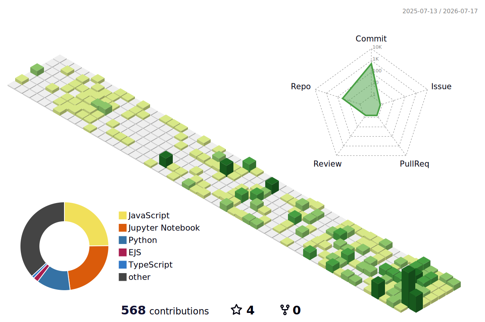

<!-- ANIMATED HEADER BANNER -->

> *In memory of my dear friends, **Stack Overflow**, **GeeksforGeeks** & **W3Schools** — I'll miss them.*

<!-- TYPING ANIMATION -->
   

 

<table>

<tr>
<td width="220" align="center">

</td>
<td><b><i>Sam33r-Shahzad</i></b></td>
</tr>

<tr><td colspan="2" height="18"></td></tr>

<tr>
<td align="center">

</td>
<td><b><i>Punjab, Pakistan</i></b></td>
</tr>

<tr><td colspan="2" height="18"></td></tr>

<tr>
<td align="center">

</td>
<td><i>Ethical Hacker • Web Application Penetration Tester • LLM Engineer • Full Stack Django Developer</i></td>
</tr>

<!-- <tr><td colspan="2" height="18"></td></tr>

<tr>
<td align="center">

</td>
<td><i>Web Application Security • AI Security • Production RAG • Fine Tuning • API Security • Full Stack Web Development</i></td>
</tr> -->

<!-- <tr><td colspan="2" height="18"></td></tr>

<tr>
<td align="center">

</td>
<td><i>Building Production AI Applications • Advanced Web Pentesting • Full Stack Web Development Projects</i></td>
</tr>

<tr><td colspan="2" height="18"></td></tr> -->

<tr>
<td align="center">

</td>
<td><i>Securing cyberspace &amp; building AI pipelines</i></td>
</tr>

</table>

> *"Code is poetry — write it beautifully."*

##  Tech Stack

<table>

<tr>
<td width="220" align="center">

</td>
<td><i>Ethical Hacking • Web Application Security • Penetration Testing • Vulnerability Assessment • OWASP Top 10 • API Security • API Testing • Burp Suite • Metasploit • Nmap • Reconnaissance • Windows & Linux Privilege Escalation • Information Security</i></td>
</tr>

<tr><td colspan="2" height="18"></td></tr>

<tr>
<td align="center">

</td>
<td><i>Large Language Models (LLMs) • Generative AI • Retrieval-Augmented Generation (RAG) • Fine-Tuning • QLoRA • AI Agents • AI Security • Machine Learning • Deep Learning • Production AI Applications</i></td>
</tr>

<tr><td colspan="2" height="18"></td></tr>

<tr>
<td align="center">

</td>
<td><i>Full Stack Development • Django • Django REST Framework • FastAPI • Next.js • React.js • JavaScript • TypeScript • Tailwind CSS • Docker • SQL • GitHub</i></td>
</tr>

<tr><td colspan="2" height="18"></td></tr>

<tr>
<td align="center">

</td>
<td><i>Python • C++ • Data Structures • Analysis of Algorithms • Object-Oriented Programming • Database Management Systems • Cloud Computing • Computer Hardware Troubleshooting</i></td>
</tr>

<tr><td colspan="2" height="18"></td></tr>

<tr>
<td align="center">

</td>
<td><i>Professional Cricket Player • Competitive PUBG Player • English & Urdu Calligraphy</i></td>
</tr>

</table>

##  GitHub Stats

##  3D Contribution Map

<picture>
  <source media="(prefers-color-scheme: dark)" srcset="./profile-3d-contrib/profile-night-green.svg">
  <source media="(prefers-color-scheme: light)" srcset="./profile-3d-contrib/profile-green-animate.svg">
  
</picture>

##  Contributions

 

##  Quote

##  Connect With Me

<!-- FOOTER WAVE -->

**⭐ If you like what you see, consider starring some repos!**

